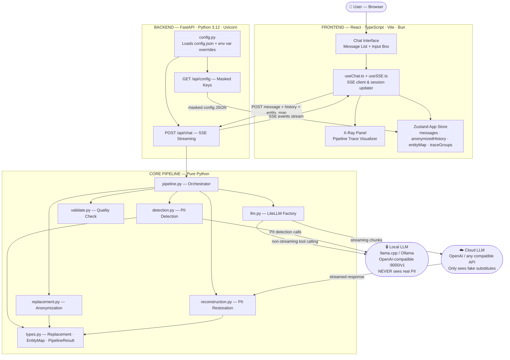
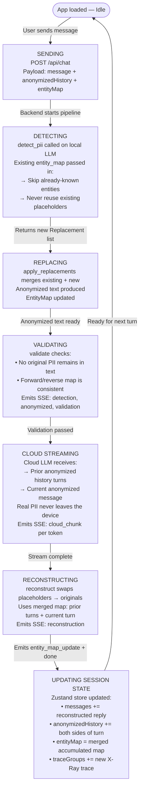
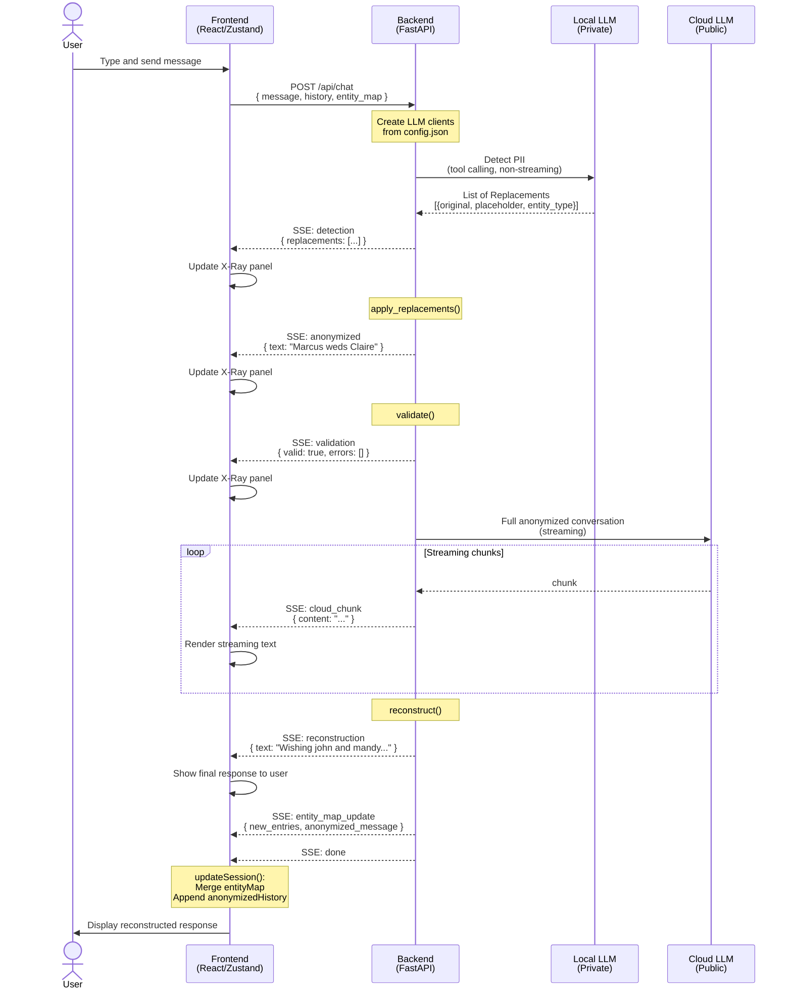
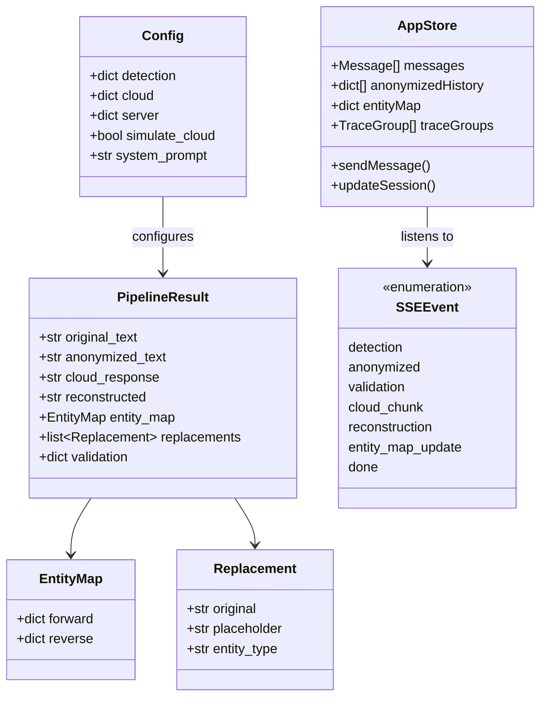
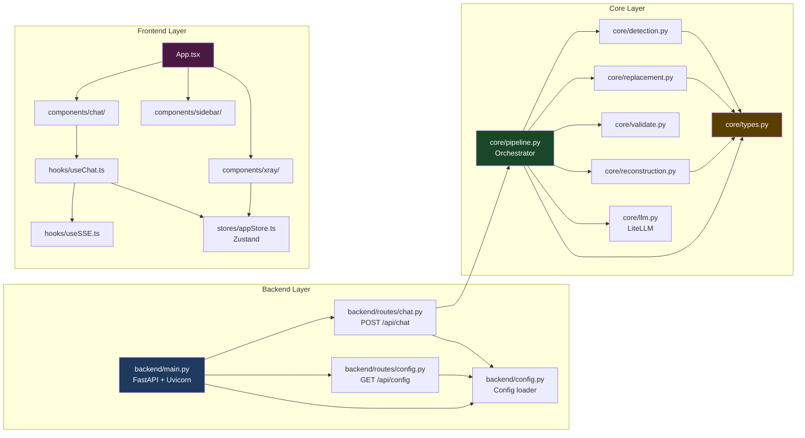

# CloakChat — Architecture & Flowcharts

> **CloakChat** is a privacy-preserving AI chat system that detects and anonymizes PII *locally* before sending anything to a cloud LLM, then reconstructs the response — keeping sensitive data entirely off third-party servers.

---

## 1. System Architecture

---

## 2. Message Processing Flowchart

```mermaid
flowchart TD
    A([👤 User sends message]) --> B["Frontend\nuseChat.ts\n\nSend POST /api/chat\n{ message, history, entity_map }"]

    B --> C["Backend\nroutes/chat.py\n\nCreate detection & cloud LLMs\nfrom config.json"]

    C --> D["core/pipeline.py\nrun_streaming()"]

    D --> E["core/detection.py\ndetect_pii()\n\nLocal LLM call with tool calling\nSkips already-known entities\nin existing entity_map"]

    E --> F{"New PII\nfound?"}

    F -->|"Yes"| G["core/replacement.py\napply_replacements()\n\nReplace original PII with\nrealistic fake substitutes\ne.g. John → Marcus\njohn@corp.com → marcus@placeholder.com"]
    F -->|"No new PII"| H["Keep text as-is\n(existing map still applies)"]

    G --> I["core/validate.py\nvalidate()\n\nCheck no original PII remains\nin anonymized text\nVerify map consistency"]
    H --> I

    I --> J{"Validation\nPassed?"}
    J -->|"Errors"| K["🔴 Emit validation event\nwith errors list\n(stream continues)"]
    J -->|"Valid"| L["🟢 Emit validation event\nvalid=true"]
    K --> M
    L --> M

    M["Build cloud messages\n\nanonymizedHistory (prior turns)\n+ current anonymized message"]

    M --> N["core/llm.py → Cloud LLM\n\nSend ONLY anonymized content\nCloud NEVER sees real PII\nStreaming mode"]

    N --> O["Stream cloud response chunks\n→ Emit cloud_chunk SSE events\n→ Frontend renders in real-time"]

    O --> P["core/reconstruction.py\nreconstruct()\n\nSwap placeholders → originals\nUsing full session EntityMap\n(prior turns + current turn)"]

    P --> Q["Emit reconstruction SSE event\nFinal response with real names\nshown to user"]

    Q --> R["Emit entity_map_update event\nnew_entries: { original: placeholder }\nanonymized_message: string"]

    R --> S["Emit done event"]

    S --> T["Frontend on done:\nupdateSession()\n• Append anonymized turns to history\n• Merge new entries into entityMap\n• Update X-Ray trace panel"]

    T --> U([✅ Ready for next turn])

    style A fill:#7c3aed,color:white
    style U fill:#059669,color:white
    style N fill:#dc2626,color:white
    style K fill:#b91c1c,color:white
    style L fill:#065f46,color:white
    style G fill:#1e40af,color:white
```

---

## 3. Multi-Turn Conversation State Management

---

## 4. SSE Event Stream Sequence

---

## 5. Data Model Overview

---

## 6. Component Dependency Map

---

## Summary

| Aspect | Detail |
|---|---|
| **Privacy Guarantee** | Real PII is detected and replaced *locally*; cloud LLM only sees realistic fake substitutes |
| **Multi-turn Safety** | `entity_map` accumulates across turns — same person always maps to same placeholder |
| **Communication** | SSE (Server-Sent Events) for real-time streaming end-to-end |
| **LLM Abstraction** | LiteLLM wraps all providers — local llama.cpp, Ollama, or any cloud OpenAI-compatible API |
| **Frontend State** | Zustand manages session: reconstructed messages, anonymized history, and entity map |
| **Observability** | X-Ray panel shows every pipeline step live: detection, anonymization, validation, cloud output, reconstruction |
